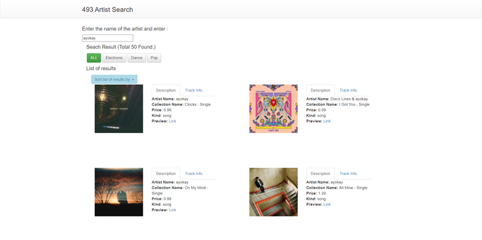
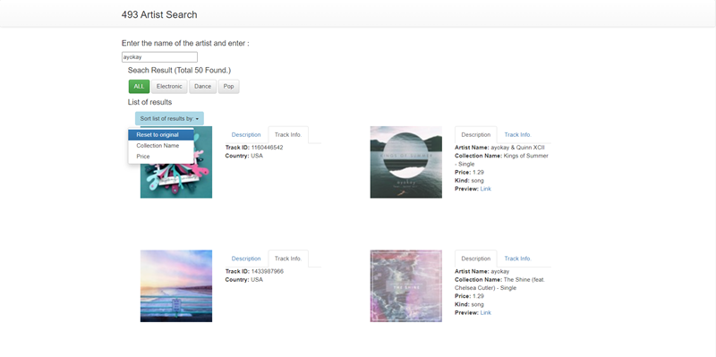
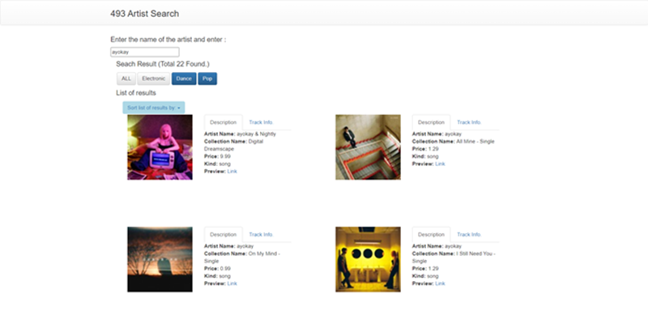

# Artist Search

## Disclaimer
This repo is just a display of a course project for EECS 493 User Interface Development @ University of Michigan. I'm excluding the code to comply with academic integrity policies.

## Technologies Used
- **Frontend**: HTML, CSS, Javascript, Vue.js, Bootstrap
- **Backend**: iTunes API (via Axios/Fetch for AJAX requests)
- **Architecture**: MVC pattern using Vue.js for modular development

## Project Overview
A responsive web application that supports artist search, built using Vue.js and the iTunes API. Features include:
- **Search Bar**: Allows users to search for artists by name, leveraging the iTunes API.
- **Artists Grid**: Displays search results in a responsive two-column grid with images and relevant information.
- **Navigation Tabs**: Tabbed interface for toggling between artist descriptions and track details.
- **Genre Selection**: Dynamic filtering of results by genre with responsive buttons.
- **Sort Menu**: Dropdown menu for sorting results by price or collection name.
- **Responsive Design**: Functional across different devices and screen sizes using Bootstrap.

## Website Features
### Search Bar
- Accepts user input and triggers an AJAX call using the iTunes API."
- Displays a "No artist found" alert if no results are returned.
- Updates the total number of results dynamically.

### Artists Grid
- Displays artist images alongside key details (e.g., name, collection, price).
- Uses Bootstrap’s grid system for a responsive layout.
- Supports multiple rows and adapts to window resizing.

### Navigation Tabs
- Two tabs for each artist: "Description" and "Track Info."
- Dynamically loads data for each tab using Vue directives.
- Allows preview links to open in a new tab or trigger downloads.

### Genre Selection
- Dynamically generates a list of available genres based on API results.
- Filters displayed artists based on selected genres.
- Includes an "ALL" button to reset the genre filter.

### Sort Menu
- Dropdown menu with three options: "Reset to original," "Sort by Collection Name," and "Sort by Price."
- Sorting applies dynamically using Vue.js reactive state management.

## Code Tree
<pre>
├── README.md
├── index.css
├── index.html
├── loading.gif
└── script.js
</pre>
